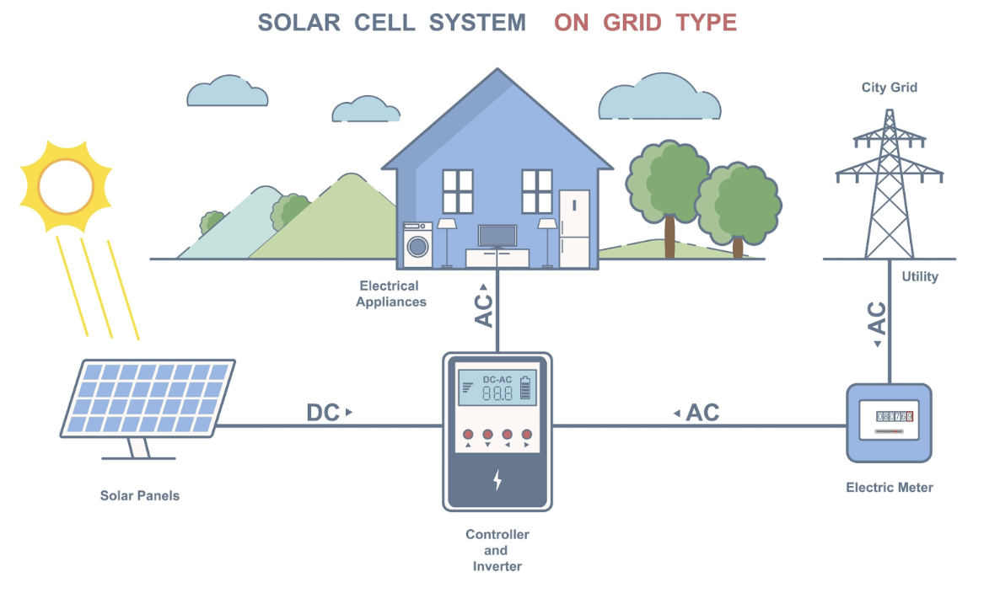
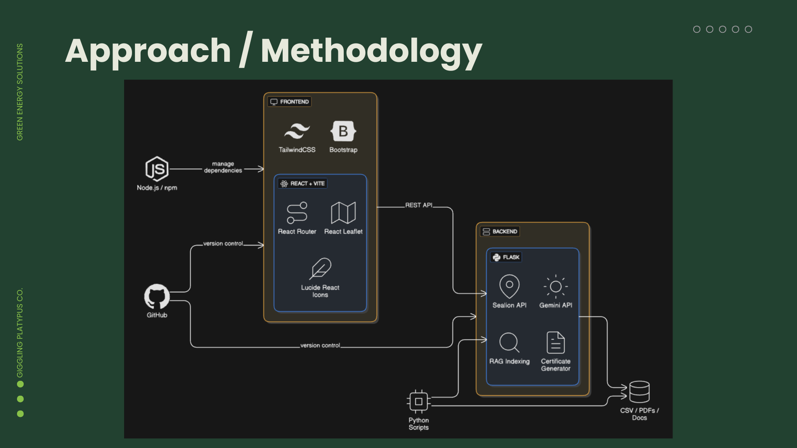

# SolarAid — AI-Powered Electricity Donation Platform
SolarAid is a renewable-energy donation platform that helps Malaysians support communities in need with clean electricity. Users can view areas needing power, donate instantly, track their impact, receive Jariah certificates, and climb donor rankings.
```
- Mission: To enable every Malaysian to support clean, reliable energy access by transforming surplus solar power into meaningful community impact.
- Vision: A Malaysia where renewable energy empowers every home, school, and community to thrive sustainably.
```

# Overview
SolarAid is an AI-powered platform that transforms surplus solar electricity into charitable energy donations.



## It helps Malaysians contribute to:
- **SDG7.1 — Universal Access to Modern Energy**
- **SDG7.2 — Increase Global Percentage of Renewable Energy**
- Sadaqah Jariyah through Green Waqf
- Electrification of rural communities in Malaysia

## SolarAid blends:
- Global sustainability standards
- Islamic finance rules
- Solar energy data
- AI forecasting and RAG-based advisory
- Automated Jariah-ready certificates
- AI smart prediction to surpass next rank
- AI eligibility check against Asnaf + Rural Beneficiary Map

# Donation Flow
## After donation:
- AI crafts a personalized gratitude message
- User receives a Jariah Certificate as a trusted record of their contribution.
- Estimated impact summary (hours powered, CO₂ saved, real-time direct impacts)
- Donation is recorded into the system for tracking 
- Leaderboard reloads automatically to reflect new rankings and updated donor positions  

### Donation Certificate
- Certificate commemorates a Sadaqah Jariah/Green Waqf donation
- Main metric of renewable energy donated in kWh unit
- Real-time direct impact breakdown (days of light, CO₂ saved)
- Inspirational quote
- Project details
- Verification chop
- Downloadable/share to social media
- Professional certificate design

### Top Donor Leaderboard
- Showing top donors with their respective kWh donated
- User's current rank
- How much more kWh needed to reach top5
- Instant comparison

# Features
1. **Jariah Certificate**: 
A professional, AI-generated certificate that enables Malaysians to post their Jariah certificate on social media for showing their social contribution proudly

2. **Future Donation Prediction (AI Leaderboard Intelligence)**: 
An energy forecasting system that predicts how much electricity the user needs to donate next month to beat the rank above them.

3. **Location-Based Donation Targeting**: 
A smart module that helps users donate electricity more meaningfully by analyzing where energy is needed the most.

4. **AI Chatbot (RAG + Chain-of-Thought Agent)**: 
A highly advanced energy donation assistant trained on Islamic finance, Malaysia electrification context, and solar panel documents.

# Backend Methodology
1. **Jariah Certificate (Sealion)**
Provides:
- Humble, poetic impact caption
- Tangible energy impact metrics (kWh, days of light, carbon dioxide saved)
- Verified certificate label for trust
Considers:
- Donor’s name & cause
- Energy equivalent of donation (RM → kWh → real-life usage)
- Malaysian cultural context & “Adab” (humility, communal tone)
- Manglish / local language flavor for relatability

2. **Future Donation Prediction (Cloudflare Workers AI)**
Provides:
- Personalized catch-up strategy and defense strategy
Considers:
- Weather seasonality
- Holidays 
- User location
- User’s historical donation pattern

3. **Location-Based Donation Targeting (Sealion)**
Performs:
- Dataset analysis
- Web search for disasters (floods, outages)
- Vulnerability prioritization
- Ranking of top 5 area

4. **RAG Chatbot (RAG)**
Assistant answers:
- Eligibility
- Waqf rules (Nisab, Asnaf)
- Malaysian NEM regulations
- Electricity saving advice
- Certificate guidance
- Rural beneficiary info
RAG Source Files:
- File	Purpose
- UN_SDG_Targets.pdf	SDG7 goals and definitions
- UNDP_Green_Waqf.pdf	Legitimacy for Green Waqf
- The_Fiqh_of_Energy.docx	Islamic rulings: Nisab, Asnaf, Sadaqah Jariyah
- Beneficiary_Map.csv	Village list and rural electrification context
- NEM_Malaysia_Rules.pdf	Legal compliance under NEM 3.0
- Impact_Formulas.txt	Convert kWh → CO₂ → impact stories



# Tech Stack
## Frontend
- React + Vite
- TailwindCSS
- React Router
- React-Leaflet
- Lucide React Icons
- Bootstrap

## Backend
- Python Flask
- Sealion API
- Cloudflare Workers AI
- Tavily Search
- Supabase
- langchain
- RAG indexing
- Certificate generator

# Folder Structure
```
SDG7_Affordable_and_Clean_Energy_TriforceTech/
├── SolarAid_App/
│   ├── src/
│   │   ├── pages/
│   │   │   ├── ChatPanel.jsx
│   │   │   ├── Dashboard.jsx
│   │   │   ├── donation_done.jsx
│   │   │   ├── donation.jsx
│   │   │   ├── DonationHistory.jsx
│   │   │   ├── Leaderboard.jsx
│   │   │   ├── login.jsx
│   │   │   ├── Overview.jsx
│   │   │   └── SmartPrediction.jsx
│   │   ├── landingpages/
│   │   │   └── LandingPage.jsx
│   │   ├── components/
│   │   │   └── Globe3D.jsx
│   │   │   └── PremiumCertificate.jsx
│   │   ├── assets/
│   │   │   └── logo.png
│   │   ├── config/
│   │   │   └── jamAI.config.js
│   │   ├── servives/
│   │   │   └── jamAI.service.js
│   │   │   └── voiceChat.integration.example.js
│   │   └── App.jsx
│   │   └── App.css
│   │   └── index.css
│   │   └── main.jsx
│   ├── backend/
│   │   ├── server.py
│   │   ├── sealion_ai/
│   │   │   ├── __init__.py
│   │   │   ├── area_detection.py
│   │   │   ├── certificate_generator.py
│   │   │   └── thanks_ai.py
│   │   ├── cloudflare_workers_ai/
│   │   │   ├── optimized_prediction_agent.py
│   │   │   └── optimized_research_agent.py
│   │   │   └── sql_agent.py
│   │   ├── database/
│   │   │   └──  supabase.py
│   │   ├── jamai_ai/
│   │   │   ├── __init__.py
│   │   │   ├── architecture.py
│   │   │   ├── audio_bridge.py
│   │   │   ├── readme.md
│   │   │   └── test_setup.py
│   │   ├── utils/
│   │   │   └── impactCalculator.py
│   │   └── __pycache__/
│   ├── node_modules/
│   ├── package.json
│   ├── index.html
│   ├── vite.config.js
│   ├── .env.example
│   ├── eslint.config.js
│   ├── FLOW_DIAGRAM.md
│   ├── package-lock.json
│   ├── package.json
│   ├── postcss.config.cjs
│   ├── tailwind.config.cjs
│   ├── test-jamaibase.js
│   └── vite.config.js
├── public/
│   ├── Idea.png
│   └── tech_stack.png
├── requirements.txt
├── package-lock.json
└── README.md
```

# Getting Start
## Backend
```
cd backend
pip install -r requirements.txt

cd SolarAid_App
python3 -m backend.server
```
## Frontend
```
cd SolarAid_App
npm install
npm run dev
```

# Design
- **Font**: Poppins
- **Background**: #FCF9EA
- **Accent Colors**:
  - #3BA0FF
  - #5A32FF
  - #6C00FF
- **Style**: Rounded corners, shadows, clean spacing

** Malaysia is rich in sunlight and kindness. ** 
** SolarAid turns both into clean energy, sustainable charity, and community empowerment. **
